# FaceCheck — Workforce Management & Payroll Platform

FaceCheck is a production B2B SaaS platform that automates workforce management and payroll compliance for construction companies. Employees clock in and out from a mobile app with GPS and photo verification; the platform tracks hours across worksites, calculates wages and payroll taxes, and generates IRS-ready tax documents that company owners manage from a web admin panel.

The system was built solo, end to end — a Spring Boot backend, an Angular admin web app, and a Flutter mobile app — and shipped to production on both the App Store and Google Play.


---

## Architecture

FaceCheck is a modular monolith: a single Spring Boot backend exposes a REST API consumed by two clients — a Flutter mobile app for field workers and an Angular admin web app for company owners. Photos and generated documents live in AWS S3, recurring payroll and tax jobs run on Quartz, and application health is monitored through Prometheus and Grafana. The system is deployed across DigitalOcean, Cloudflare, and Neon.

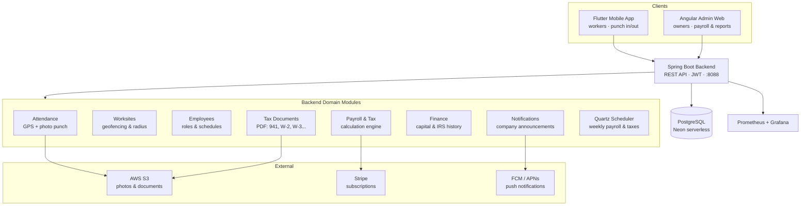

**Deployment topology:**

```
Field workers   → Flutter app        → App Store / Google Play
Company owners  → Angular admin       → Cloudflare Pages (face-check.org)
                        │
                        ▼
                  Spring Boot API      → DigitalOcean App Platform
                        │
                        ▼
                  PostgreSQL           → Neon (serverless)
```

---

## Web Admin Panel (Angular)

The admin panel is the company owner's control center. Everything below is a working feature backed by REST endpoints and persisted to PostgreSQL.

### Dashboard

The landing view greets the owner by name and company, and surfaces quick actions — add employee, manage worksites, track locations, view reports, settings, and company info — alongside a recent-activity feed. The left navigation exposes every module: Company, Worksites, Employees, Finance, Location, Attendance, Attendance Statistics, Notifications, Notes, and Settings.

### Worksite management with geofencing

Owners register physical worksites, each with an address, working hours, GPS coordinates (latitude/longitude), and an allowed punch-in radius in meters. This radius is the geofence: the mobile app only accepts a punch when the worker is physically inside it.

A worksite detail view shows the full configuration and lets the owner update working hours, location, and radius independently, or view the workers currently active on that site. A dedicated location view renders the worksite on a Leaflet map with a visual punch-in/out zone drawn as a radius circle, so the owner can see exactly where the geofence sits.

### Employee management

A paginated employee table lists each worker with photo, ID, name, email, and hourly rate. From an employee's detail view the owner can:

- Change the worker's role — **Remote Worker**, **In-Person Worker**, promote to **Admin**, or demote to a regular user
- Set a manual punch-in or punch-out for missed days (with date and exact time), for cases where a worker forgot to clock in
- Update the hourly rate

### Work schedule management

Each employee has a weekly schedule configured per day of the week — start time, end time, and a lunch break window, with a "day off" toggle and an option to mark whether the company pays for the lunch break. The current schedule is shown at a glance, and the owner edits any day independently.

### Attendance tracking

The attendance module monitors all check-ins and check-outs across the company. A paginated records table shows, per punch: worker name, company, email, phone, check-in and check-out timestamps **with the GPS address of each**, hours worked, overtime hours, and gross pay for that shift. Separate tabs handle **worksite transfers** and **remote workers**, so the owner can see who moved between sites and who is working off-site.

### Attendance photo verification

Because every punch is photo-verified, the platform stores a photo per check-in and check-out. A dedicated view lists all employees with a per-employee photo count and totals, letting the owner click into any worker to review their verification photos.

### Finance management

The finance module tracks the company's payroll economics: company capital, total expenses, salary cost, and current capital, with a budget-vs-current-capital breakdown. It maintains an **IRS Payment History** table (date, payment type such as 941 or 940 tax, quarter/year, amount, notes), and supports adding budgets, recording IRS payments, and generating reports — tying attendance and payroll data back to what the company actually owes and pays.

### Company notifications

Owners compose and send announcements to all employees (up to 500 characters), delivered to workers' phones. The view tracks total sent, today's count, and recipients.

---

## Mobile App (Flutter)

The mobile app is what the field worker uses on site. It handles the camera, GPS, background location, and push notifications.

### Home & punch

The home screen shows the current week's tracked hours in a progress ring, the last punch timestamp, an active/inactive status, and a large **Punch** button. The punch screen shows a live map centered on the worker's location, the resolved worksite (e.g. "Dumbo Worksite"), a live clock, and a **Punch In** action — which fires only when the worker is inside the worksite's geofence and captures a verification photo.

### Productivity

A productivity view summarizes the worker's week: total hours, overtime, missed hours, status, and productivity/efficiency metrics, plus an earnings overview (hourly rate, week total, and progress toward target).

### Finance / earnings

A per-worker finance screen breaks the week down day by day — hours and gross pay for each day — with a week-period selector and export/share actions, so the worker can see exactly how their pay was computed.

### Notifications

Workers receive company announcements and reminders (e.g. "report to work at 10:00 AM", "check that your worked hours are correct") as in-app and push notifications.

---

## Technical Highlights

### Punch-in latency: 1872 ms → 38 ms (≈49× faster)

The original punch-in flow blocked the request thread while uploading the worker's verification photo to S3 **inside the database transaction** — the S3 upload alone accounted for roughly 1.8 seconds of the response time.

The fix decoupled the photo upload from the request path: the attendance record is saved immediately with a placeholder URL, the response returns to the mobile client right away, and the S3 upload runs asynchronously via `CompletableFuture`, updating the record with the final photo URL once complete. Error handling was added so a failed upload marks the record instead of silently losing the punch.

The result cut response time from **1872 ms to 38 ms** and lifted the endpoint's practical throughput from tens of concurrent requests into the hundreds. This is the single change that turned punch-in from the system's main bottleneck into a non-issue.

### Payroll and tax compliance engine

The platform computes gross and net pay, overtime, sick days, and the full stack of US payroll taxes — federal income tax, Social Security (6.2%), Medicare (1.45%), FUTA, SUTA, and NY state — then generates the corresponding IRS and state documents as filled PDFs, stored in S3 and downloadable from the admin panel:

- Paystubs
- W-2, W-3, W-4
- Form 940 (FUTA annual)
- Form 941 and 941 Schedule B (quarterly federal)
- MTA-305, NYS-45 and related state forms
- Hours, payroll, and tax summary reports

PDF generation services are covered by JUnit and Mockito unit tests exercising real edge cases — monthly vs. semiweekly depositor logic, wage thresholds, filing statuses, prepayments and credits, and S3 upload failures.

The platform is deliberately positioned as a **software provider**: it prepares and generates documents but does not e-file or submit on anyone's behalf. The owner downloads the files and handles submission, which keeps FaceCheck clear of e-filing licensing requirements.

### GPS geofencing

Worksites carry coordinates and a punch radius; a punch is only accepted when the worker's device location falls inside that radius. The admin visualizes each geofence as a radius circle on a Leaflet map, and the mobile app resolves the nearest valid worksite before allowing a punch.

### Serverless database tuning

Deploying to Neon's serverless PostgreSQL surfaced a subtle cost issue: default HikariCP settings (`minimum-idle > 0`) plus the Actuator DB health check kept connections alive, preventing the database compute from ever auto-suspending — burning compute hours around the clock. Tuning the pool for serverless (`minimum-idle=0`, `idle-timeout=30s`) and disabling the DB health probe let the database sleep when idle, cutting monthly compute from 240+ hours to roughly 5–10.

### Monitoring

The backend exposes custom application metrics through Prometheus and Grafana, including PDF-generation success rates and a database connection-pool monitor that alerts when pool usage crosses a threshold — the same monitor that surfaced the serverless tuning issue above. Alerting is configured via `prometheus.yml`, `alertmanager.yml`, and `alerts.yml`.

---

## Tech Stack

**Backend:** Java 21, Spring Boot, Spring Security (JWT), Spring Data JPA, PostgreSQL, Flyway, Quartz Scheduler, AWS S3, Stripe, JUnit, Mockito, Testcontainers, Prometheus & Grafana

**Web:** Angular, TypeScript, Leaflet (worksite maps & geofence visualization), OpenAPI-generated client

**Mobile:** Flutter, Dart (camera, GPS, background location, push notifications)

**Infrastructure:** DigitalOcean App Platform (backend), Cloudflare Pages (web), Neon serverless PostgreSQL, Docker Compose (local), App Store & Google Play (mobile)

---

## Screenshots

### Web Admin

**Dashboard**
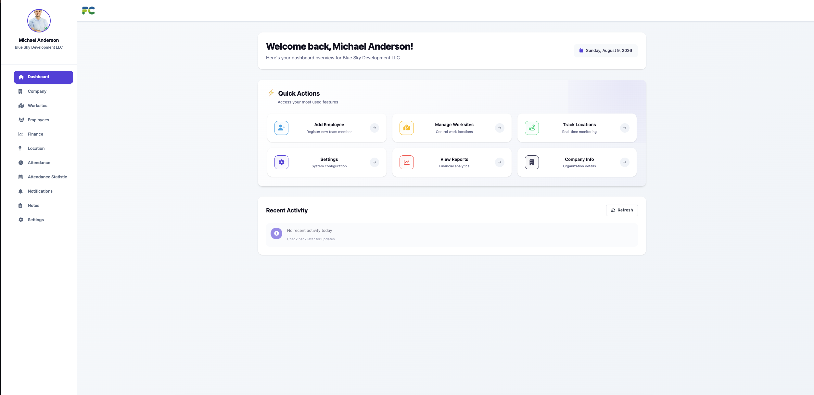

**Worksite management**
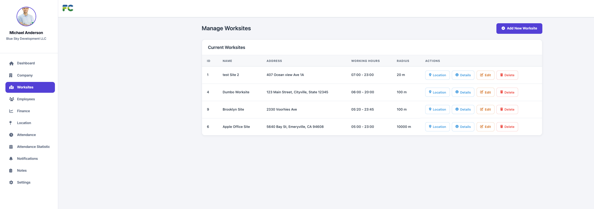

**Worksite details**
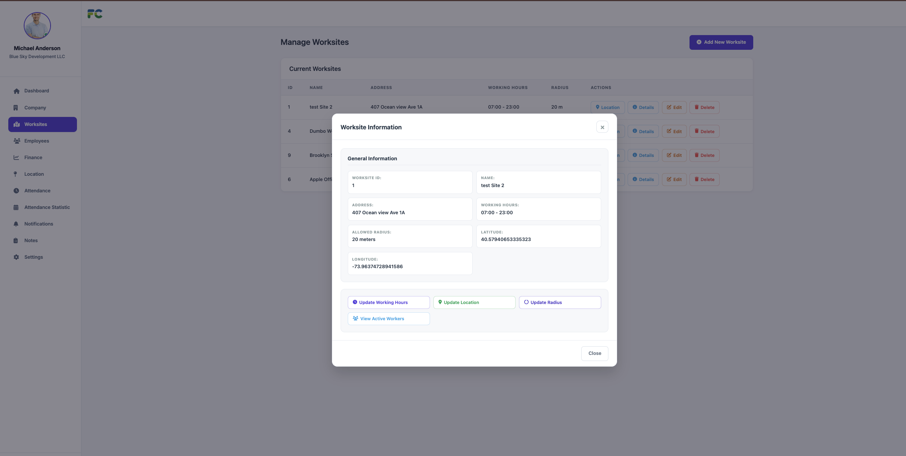

**Worksite location & geofence (Leaflet)**
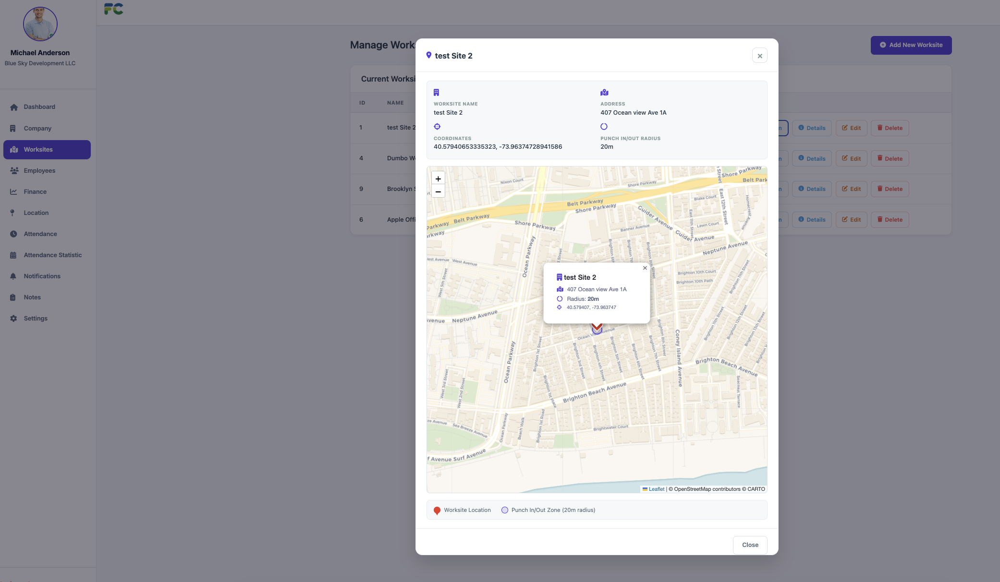

**Employee management**
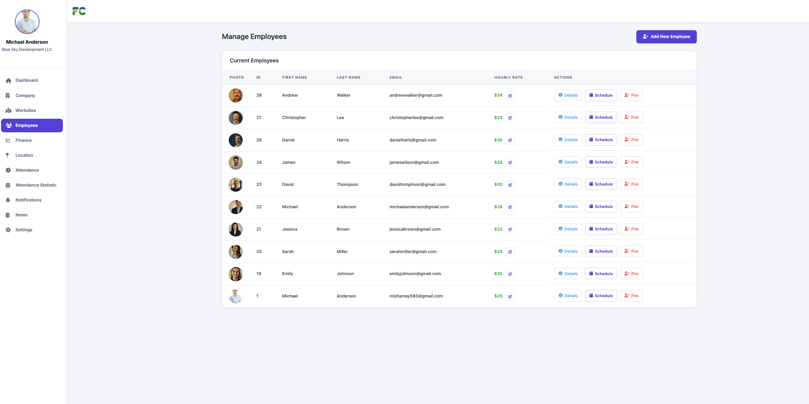

**Employee details & roles**
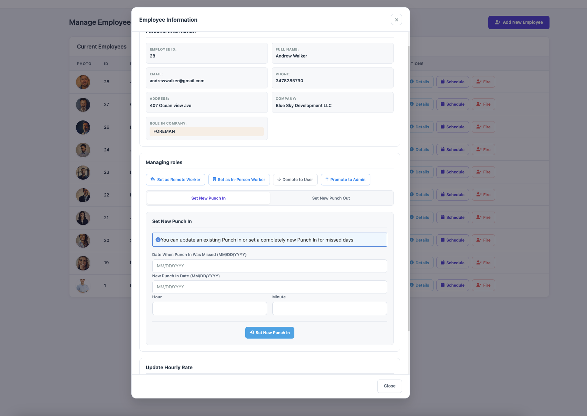

**Work schedule management**
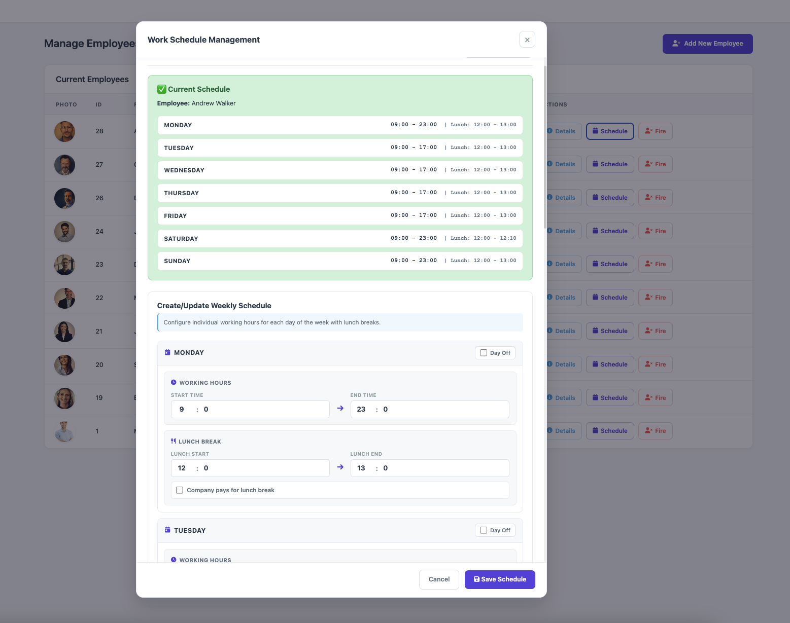

**Attendance tracking**
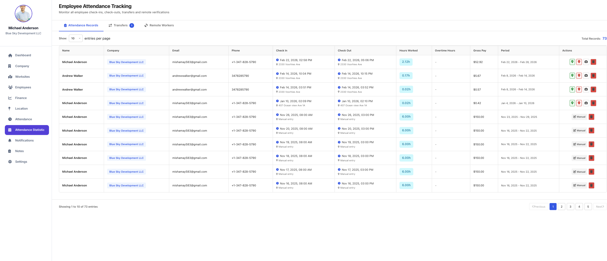

**Attendance photo verification**
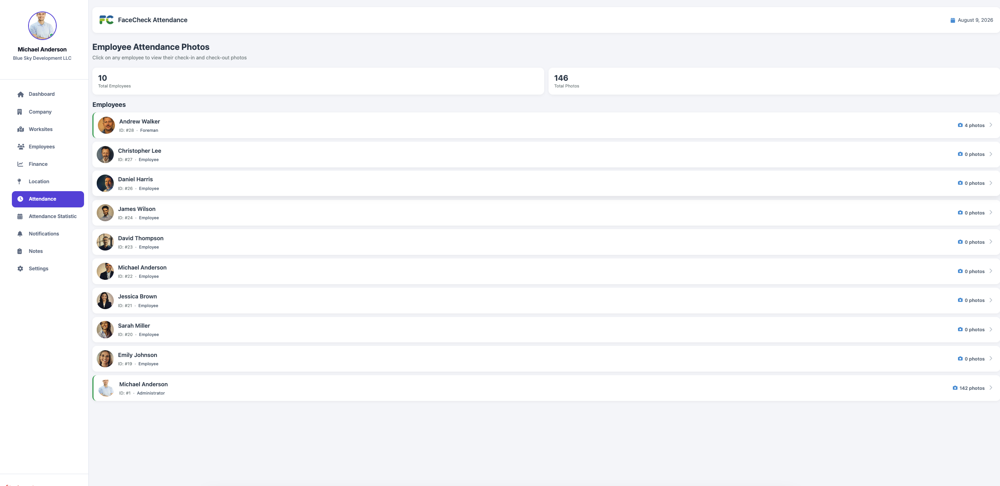

**Finance management**
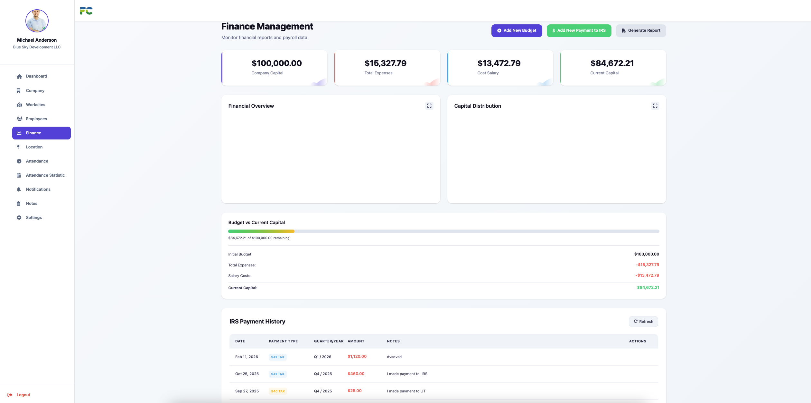

**Company notifications**
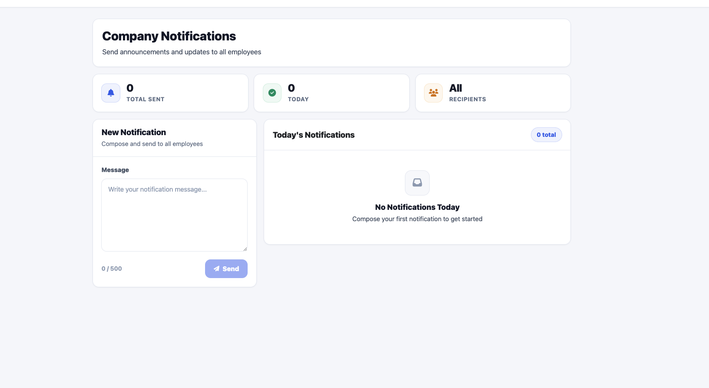

### Mobile App

**Home & punch**
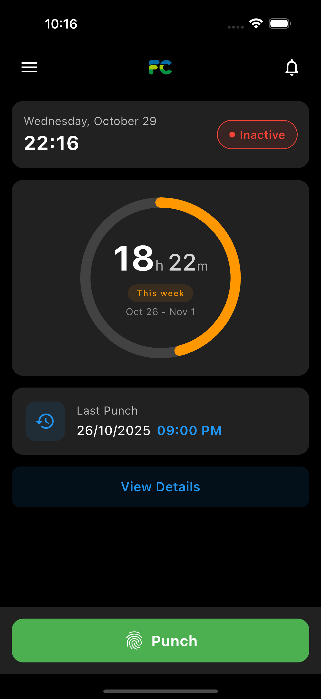

**Punch screen with live location**
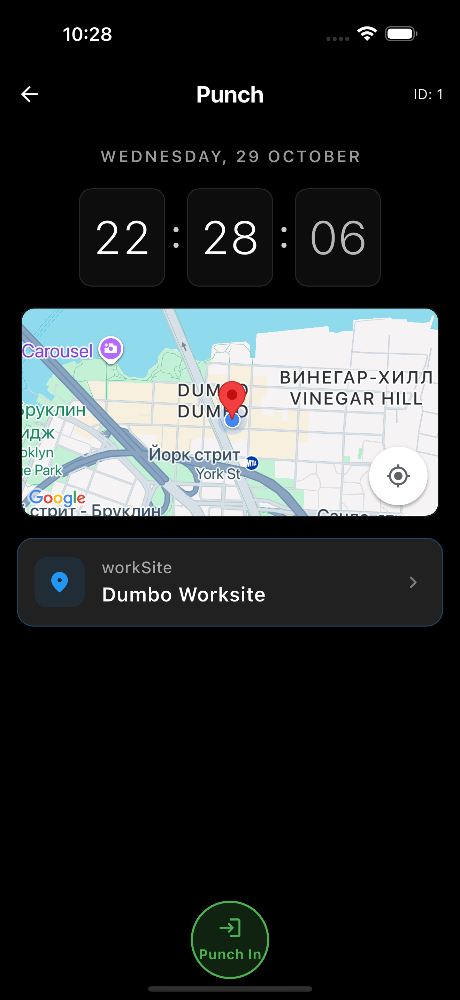

**Productivity**
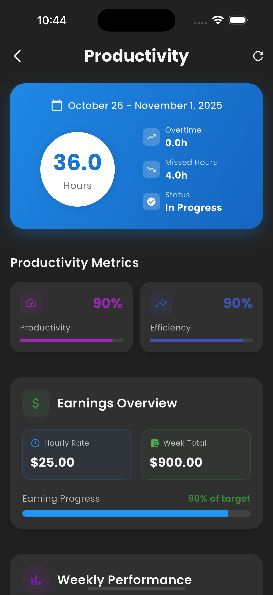

**Finance / earnings**
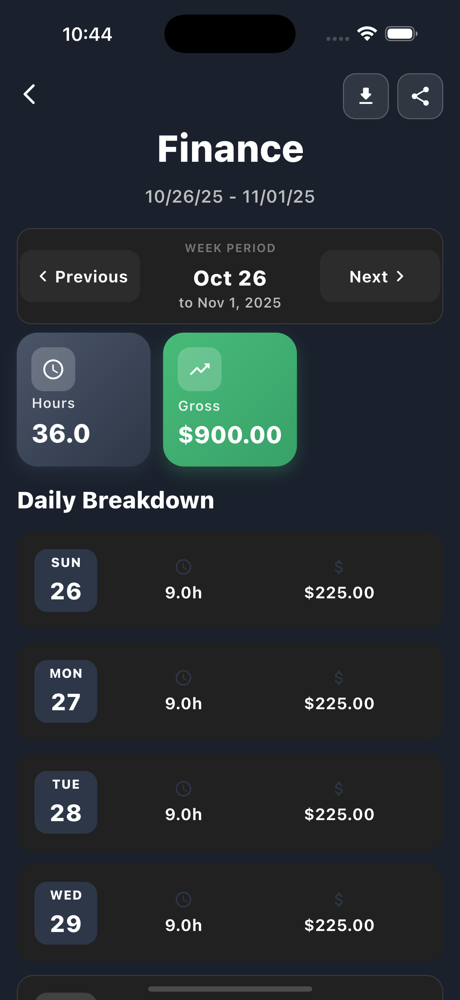

**Notifications**
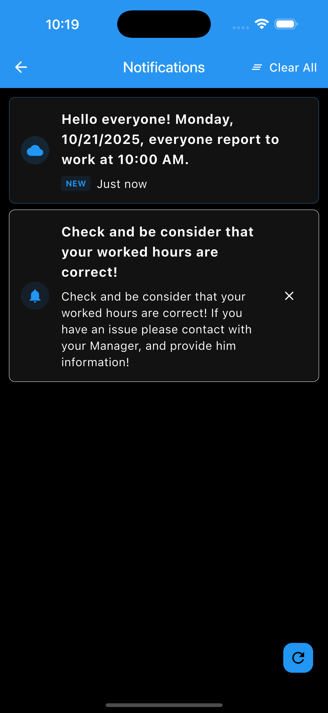

---

## Project Structure

```
face-check-app/
├── face-check/       Spring Boot backend — attendance, payroll, tax forms, finance
├── face-check-ui/    Angular admin panel
├── face_check/       Flutter worker app
├── docker/           Docker configuration
├── prometheus.yml    Monitoring configuration
├── alertmanager.yml
└── docker-compose.yml
```
